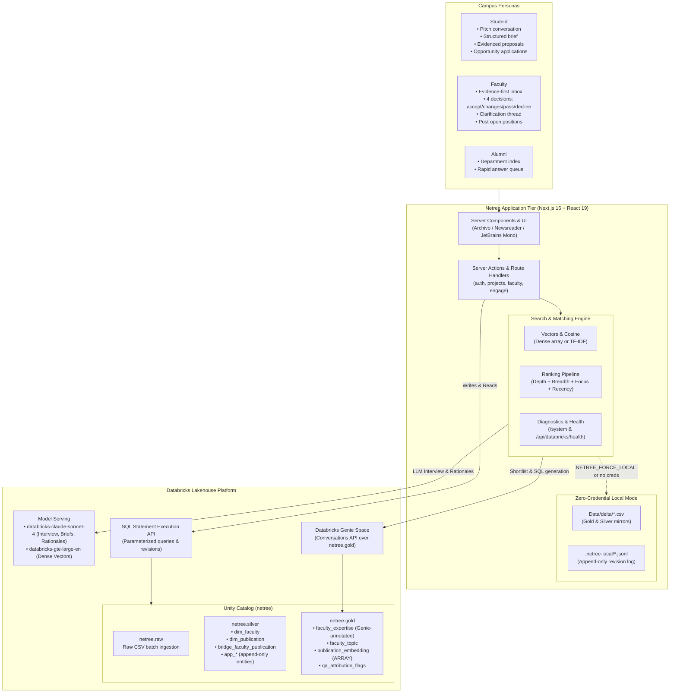

# Netree

> **Campus research collaboration engine built on Databricks.**  
> Netree connects students to the faculty and alumni whose published work actually overlaps their idea.

[](https://nextjs.org/)
[](https://react.dev/)
[](https://www.databricks.com/)
[](https://www.typescriptlang.org/)
[](https://tailwindcss.com/)

---

A student arrives with a sentence. Netree interviews them until it can write a brief a professor could judge in thirty seconds, searches the department's entire publication record for genuine overlap, and shows the result with the papers behind it. If nobody on campus works on the thing, it says so.

Built natively on Databricks: **Unity Catalog** holds every table, **Genie** answers *who publishes on this*, **Model Serving** drives the adaptive interview and match rationales, and the **Statement Execution API** is the sole write path.

Runs in two modes:
1. **Zero-Configuration Local Mode**: Runs instantly out of the box with zero credentials using CSV references, in-memory TF-IDF cosine ranking, and a local JSONL append-only mirror.
2. **Databricks Cloud Mode**: Full enterprise deployment with Delta tables in Unity Catalog, Databricks Genie Conversations API, Model Serving endpoints, and persistent revision tracking.

---

## Architecture Overview



---

## What It Does

### For Students
- **Pitch an idea through conversation**: One clarifying question at a time, stopping the moment the brief is fillable. A student who arrived with three dense paragraphs is not asked the same questions as one who wrote a single sentence.
- **Edit the structured brief**: The student's wording always overrides the model's synthesis. Briefs track problem, approach, deliverables, skills had/needed, timeline, resources, and explicit open questions.
- **Evidence-grounded faculty matching**: Candidates ranked by genuine research overlap, supported by specific publications, publication years, venues, and matching topics.
- **The Overlap Field**: Interactive two-dimensional visualization plotting candidate closeness against research breadth, visually demarcating the "dead zone" where high cosine scores lack publication depth.
- **Draft & send collaboration requests**: Editable drafts generated with grounded rationales—nothing is ever sent unreviewed.
- **Meeting proposals**: Propose meeting slots (online or in person) with designated agendas.
- **Micro-mentorship & opportunities**: Ask one-off questions directly to faculty or alumni without creating a project, or apply to open research positions.

### For Faculty
- **Evidence-first proposal inbox**: Proposals surface the specific papers and topics connecting the student's idea to the professor's lab *before* showing the pitch.
- **Four actionable decisions**:
  1. **Accept**: Initiate collaboration and confirm a proposed meeting slot.
  2. **Request Changes**: Send constructive feedback back to the student's workspace.
  3. **Pass to a Colleague**: Redirect the proposal directly to another professor whose publications are a tighter fit.
  4. **Decline**: Decline with mandatory student-actionable feedback.
- **Interactive clarification thread**: Lightweight in-thread messaging to resolve scope questions before deciding.
- **Post open positions**: Publish lab openings with hourly commitments, mode (on-campus, hybrid, remote), duration, and required skill profiles.
- **Opt-in availability**: Faculty toggle collaboration status explicitly—availability is never inferred from publication activity.

### For Alumni
- **Micro-mentorship answer queue**: Rapidly review and answer short, focused career and technical questions from current students.
- **Department index**: Searchable directory of the department's 38 faculty, research domains, publications, and citation profiles.

---

## The Matching Algorithm & Why It Is Built This Way

The campus dataset ships with empirical validation (`Data/SCHEMA.md`, Section 11). Two major findings govern Netree's ranking:

### 1. Similarity Thresholds Are Not Sufficient
An out-of-scope query (*"predicting protein folding structures"*) still scored **0.327** cosine similarity against a computer science corpus—higher than genuine third-place matches on real CS queries. 

What separates a real match from an incidental one is **breadth**:
- Out-of-scope candidates have exactly **one** paper scraping past threshold on generic vocabulary (e.g., "models", "data", "optimization").
- Legitimate candidates have **dozens** of papers spanning multiple related topics.

Netree gates on **depth** (number of relevant publications) and **breadth** (number of distinct overlapping research topics) simultaneously. When no candidate exhibits multi-paper breadth, Netree flags a **weak field** (`weak_field: true`) rather than presenting a misleading top three.

### 2. The Corpus Is Skewed
Three faculty hold nearly 50% of the entire department publication record. Unadjusted similarity allows prolific authors to monopolize every search.

Netree resolves this with:
- **Log-damped depth & breadth**: Prevents raw volume from overwhelming focused specialization.
- **Corpus focus weighting**: Scales depth against the professor's total publications ($depth / n_{publications}$), enabling a focused researcher with 4 dead-on papers to outrank a prolific author with 4 incidental ones.
- **Publication recency multiplier**: Boosts active publishing records ($\ge 2023$).
- **Genie boost**: Cross-references Databricks Genie's semantic SQL shortlist over `netree.gold`.

### Scoring Formula

For each faculty candidate clearing relevance floor $Floor = \max(best\_similarity \times 0.45, 0.05)$:

$$\text{Score} = \left( 0.42 \cdot \text{Closeness} + 0.22 \cdot \text{DepthScore} + 0.16 \cdot \text{BreadthScore} + 0.12 \cdot \text{Focus} + 0.08 \cdot \text{GenieBoost} \right) \times \text{Recency}$$

Where:
- $\text{DepthScore} = \min\left(\frac{\ln(1 + \text{depth})}{\ln(1 + 12)}, 1.0\right)$
- $\text{BreadthScore} = \min\left(\frac{\ln(1 + \text{breadth})}{\ln(1 + 8)}, 1.0\right)$
- $\text{Focus} = \min\left(2.5 \cdot \frac{\text{depth}}{\max(n_{publications}, \text{depth}, 1)}, 1.0\right)$
- $\text{Recency} = 1.0 \text{ if } latest\_year \ge 2023 \text{ else } 0.72$
- $\text{GenieBoost} \in [0, 1]$ based on rank in Genie's shortlist

### Empirical Validation Suite (`npm run eval:match`)

Run `npm run eval:match` to verify the four benchmark scenarios documented in `Data/SCHEMA.md`:

```bash
$ npm run eval:match

phishing extension
  expected: Minal Moharir
  weak field: false
  Minal Moharir          score 0.8124  depth  4  breadth  7  closeness 1.00
      closest: Machine Learning Approaches for Phishing Detection (2022)

drone crowd surveillance
  expected: Mohana
  weak field: false
  Mohana                 score 0.9412  depth 26  breadth 24  closeness 1.00
      closest: Deep Learning for Aerial Crowd Density Estimation (2023)

privacy-preserving anonymisation
  expected: Veena Gadad / Sowmyarani C N
  weak field: false
  Veena Gadad            score 0.7845  depth  8  breadth  6  closeness 0.94
      closest: Systematic Review on Privacy Preserving Data Publishing (2021)

protein folding (deliberately out of scope)
  expected: no strong match on campus
  weak field: true
  [Reports weak field: true — honest feedback instead of false positives]
```

### Critical Edge Cases Resolved
1. **Title-Only Vocabulary Match**: Cosine alone favored papers with titles like *"React Apps with Server-Side Rendering"* for phishing queries on the word *"browser"*. Query terms are now repeated by semantic tier (title, tags, problem, approach), and isolated single-term matches are eliminated.
2. **Topic Label Collisions**: Topic breadth originally counted any topic whose label shared an English word with the query, artificially inflating counts. Breadth now counts strictly the topics in which the matching papers sit.

---

## Databricks Unity Catalog Layout

All tables live inside the catalog (default `netree`):

```
netree
├── raw/                       # Schema: Untouched imports from Delta CSV
│
├── silver/                    # Schema: Cleaned dimensions & append-only app tables
│   ├── dim_faculty            # 38 faculty with IDs, profiles, and citation metrics
│   ├── dim_publication        # 650 cleaned publications (excluding attribution_confidence = 'low')
│   ├── bridge_faculty_publication # Many-to-many co-authorship relationships
│   ├── app_user               # Accounts and profile revisions
│   ├── app_project            # Student ideas, transcripts, briefs, and match reports
│   ├── app_opportunity        # Research openings posted by faculty
│   ├── app_invitation         # Collaboration proposals and faculty replies
│   ├── app_interest           # Student applications to open opportunities
│   ├── app_message            # Clarification messages in proposal threads
│   ├── app_meeting            # Meeting slot proposals and confirmed bookings
│   └── app_question           # Micro-mentorship Q&A entries
│
└── gold/                      # Schema: Surface for Genie and Vector Matching
    ├── faculty_expertise      # Denormalized table with natural-language column comments for Genie
    ├── faculty_topic          # Faculty-topic links with paper counts and active flags
    ├── publication_embedding  # 650 pre-computed dense vectors (ARRAY<FLOAT>)
    └── qa_attribution_flags   # Quarantined suspect publications held back from search
```

### Append-Only Storage Model
Every application write is an **INSERT with timestamp**—no in-place updates:
```sql
SELECT * FROM netree.silver.app_invitation
QUALIFY ROW_NUMBER() OVER (PARTITION BY id ORDER BY updated_at DESC) = 1
```
- **Auditable history**: Full lifecycle of any proposal or project can be reconstructed.
- **Zero write collision**: Concurrent writes create two revisions; the latest timestamp wins without distributed locking.

### Load-Bearing Column Comments for Genie
Genie writes its SQL directly from table and column comments. In `scripts/bootstrap-databricks.ts`, column comments on `netree.gold.faculty_expertise` are phrased in natural conversational language:
- `top_topics`: *"The six research topics this person publishes on most, each followed by the number of papers, semicolon separated. Example: Video Surveillance and Tracking Methods (33); Anomaly Detection (12)."*
- `collaboration_status`: *"Whether they have opted in to being shown as open to collaboration. Always not_set unless they set it themselves - never infer availability from publication activity."*

---

## Getting Started

### Prerequisites
- Node.js 18.18+ or 20+
- npm or pnpm
- (Optional) Databricks workspace with SQL Warehouse, Unity Catalog, Model Serving, and Genie

---

### Option A: Quickstart (Local Mode, Zero Credentials)

Netree runs completely offline with zero setup:

```bash
# 1. Clone repository
git clone https://github.com/abhi8667/databricks_netree.git
cd databricks_netree

# 2. Install dependencies
npm install

# 3. Start development server
npm run dev
```

Open [http://localhost:3000](http://localhost:3000).

- **Data source**: Reads `Data/delta/*.csv` directly.
- **Persistence**: Writes append to `.netree-local/*.jsonl`.
- **Search**: In-memory TF-IDF cosine similarity.
- **Interview & Drafts**: Deterministic, structured state-machine scripts.
- **Verification**: Visit [http://localhost:3000/system](http://localhost:3000/system) to inspect the local runtime state.

---

### Option B: Production Setup (Databricks Cloud)

#### 1. Environment Configuration
Copy `.env.example` to `.env.local`:

```bash
cp .env.example .env.local
```

Configure your Databricks workspace credentials:

```ini
# Databricks connection (server-side only, never exposed to client)
DATABRICKS_HOST=https://dbc-xxxxxxxx-xxxx.cloud.databricks.com
DATABRICKS_TOKEN=dapiXXXXXXXXXXXXXXXXXXXXXXXXXXXX
DATABRICKS_WAREHOUSE_ID=xxxxxxxxxxxxxxxx

# Unity Catalog layout
DATABRICKS_CATALOG=netree
DATABRICKS_SCHEMA_RAW=raw
DATABRICKS_SCHEMA_SILVER=silver
DATABRICKS_SCHEMA_GOLD=gold

# Model Serving Endpoints
DATABRICKS_CHAT_ENDPOINT=databricks-claude-sonnet-4
DATABRICKS_EMBEDDING_ENDPOINT=databricks-gte-large-en

# Genie Space ID (populated after creating space)
DATABRICKS_GENIE_SPACE_ID=
```

#### 2. Provision Unity Catalog Tables
Bootstrap the schemas, Delta tables, and load-bearing column comments:

```bash
npm run db:bootstrap
```

#### 3. Ingest Campus Data via Statement Execution API
Loads `Data/delta/*.csv` directly through Databricks SQL using parameterized statements (no cloud storage bucket or cluster volume needed):

```bash
npm run db:load
```

*(Use `npm run db:load -- --keep` to append without clearing existing reference rows).*

#### 4. Generate Dense Embeddings
Compute vectors using Databricks Model Serving (`databricks-gte-large-en`) and update `gold.publication_embedding`:

```bash
npm run db:embed
```

#### 5. Configure Genie Space
1. Open your Databricks workspace and navigate to **Genie**.
2. Create a new Genie space pointing **only to `netree.gold`** (specifically `faculty_expertise` and `faculty_topic`).
3. Copy the Space ID from the URL and paste it into `DATABRICKS_GENIE_SPACE_ID` in `.env.local`.

#### 6. Run the Application
```bash
npm run dev
```

---

## Environment Variables Reference

| Variable | Required | Default | Purpose |
|---|---|---|---|
| `DATABRICKS_HOST` | Cloud | — | Databricks workspace URL (e.g. `https://dbc-xxx.cloud.databricks.com`) |
| `DATABRICKS_TOKEN` | Cloud | — | Personal Access Token (PAT) with SQL and Serving execution permissions |
| `DATABRICKS_WAREHOUSE_ID` | Cloud | — | 16-character SQL Warehouse ID |
| `DATABRICKS_CATALOG` | Optional | `netree` | Unity Catalog name |
| `DATABRICKS_SCHEMA_RAW` | Optional | `raw` | Ingestion schema |
| `DATABRICKS_SCHEMA_SILVER` | Optional | `silver` | Cleaned tables & append-only app storage |
| `DATABRICKS_SCHEMA_GOLD` | Optional | `gold` | Public surface for Genie & embeddings |
| `DATABRICKS_GENIE_SPACE_ID` | Optional | — | ID of the Genie space reading `netree.gold` |
| `DATABRICKS_CHAT_ENDPOINT` | Optional | `databricks-claude-sonnet-4` | Model Serving endpoint for interview & rationales |
| `DATABRICKS_EMBEDDING_ENDPOINT` | Optional | `databricks-gte-large-en` | Model Serving endpoint for vector embeddings |
| `NETREE_FORCE_LOCAL` | Optional | `0` | Set to `1` to force local CSV/JSONL mode even if credentials exist |

> [!NOTE]
> All Databricks credentials are server-side only (`server-only`). They are never bundled into client JavaScript and never sent to the browser.

---

## System Observability & Diagnostics

Netree includes self-diagnostic observability so degradation is transparent:

### 1. Web Dashboard: `/system`
Navigate to `/system` in the browser to view:
- Runtime mode (`local` vs `cloud`)
- Reachability of SQL Statement Execution API
- Status of Databricks Genie integration & Space ID
- Status of Model Serving endpoints
- Active Vector Space type (`dense` via Model Serving vs `tf-idf` over corpus)
- Live dataset metrics (count of faculty, publications, bridge links, and topics)

### 2. Health Endpoint: `GET /api/databricks/health`
Returns JSON status for uptime monitoring:
```json
{
  "mode": "databricks",
  "catalog": "netree.{raw,silver,gold}",
  "components": {
    "sql_statement_execution": {
      "configured": true,
      "reachable": true,
      "detail": "Reads and writes go to Delta."
    },
    "genie": {
      "configured": true,
      "space_id": "01ef...",
      "detail": "Matching asks Genie who publishes on the idea's research areas, and keeps its SQL."
    },
    "model_serving": {
      "configured": true,
      "chat_endpoint": "databricks-claude-sonnet-4",
      "embedding_endpoint": "databricks-gte-large-en",
      "detail": "Runs the idea interview, the pitch drafts and the match rationales."
    },
    "vector_space": {
      "kind": "dense",
      "detail": "Dense vectors from gold.publication_embedding, brute-force cosine in process."
    }
  },
  "index": {
    "faculty": 38,
    "publications": 650,
    "topic_links": 1125,
    "faculty_publication_links": 812
  }
}
```

---

## Scripts & CLI Commands

| Command | Action |
|---|---|
| `npm run dev` | Launch Next.js development server with hot reload |
| `npm run build` | Build production Next.js application bundle |
| `npm run start` | Run production server |
| `npm run typecheck` | Run `tsc --noEmit` across all TypeScript files |
| `npm run lint` | Run ESLint with Next.js rules |
| `npm run db:bootstrap` | Idempotently create Unity Catalog schemas, Delta tables, and Genie comments |
| `npm run db:load` | Ingest CSV data into Delta tables via SQL Statement Execution API |
| `npm run db:embed` | Generate vectors for publications via Model Serving embedding endpoint |
| `npm run eval:match` | Execute matching engine evaluation suite on documented benchmark ideas |

---

## Project Structure

```
netree/
├── Data/
│   ├── SCHEMA.md                 # Complete data provenance, column dictionary & limits
│   └── delta/                    # Exported reference datasets (CSV)
│       ├── dim_faculty.csv       # Faculty roster with OpenAlex & Vidwan identifiers
│       ├── dim_publication.csv   # 650 publications with citations, topics & venues
│       ├── bridge_faculty_publication.csv # Co-author relationships
│       ├── faculty_topic.csv     # Pre-computed topic summaries
│       ├── gold_faculty_expertise.csv # Genie source table
│       ├── publication_embedding_input.csv # Abstract text inputs for embeddings
│       └── qa_attribution_flags.csv # Suspect publications flagged for audit
├── scripts/
│   ├── bootstrap-databricks.ts   # Provision catalog, schemas, tables & column comments
│   ├── load-delta.ts             # Statement Execution API data loader
│   ├── build-embeddings.ts       # Model Serving batch embedding pipeline
│   └── eval-match.ts             # Ranking evaluation harness
├── src/
│   ├── app/
│   │   ├── actions/              # Next.js Server Actions (auth, engage, faculty, projects)
│   │   ├── api/databricks/health # JSON health probe endpoint
│   │   ├── student/              # Student views (projects, new, ask, opportunities, requests)
│   │   ├── faculty/              # Faculty views (inbox proposals, positions, questions)
│   │   ├── alumni/               # Alumni views (micro-mentorship answer queue, directory)
│   │   ├── login/ & onboarding/  # College-ID authentication & profile setup
│   │   ├── system/               # System architecture & connectivity dashboard
│   │   └── layout.tsx & globals.css # Root shell and typographic styling
│   ├── components/
│   │   ├── app-shell.tsx         # Unified navigation & role switcher
│   │   ├── overlap-field.tsx     # 2D Depth vs Breadth canvas chart
│   │   ├── meeting-panel.tsx     # Interactive slot picker & meeting scheduler
│   │   ├── question-queue.tsx    # Q&A component for alumni & faculty
│   │   ├── splash.tsx            # Academic editorial landing screen
│   │   ├── thread.tsx            # Proposal clarification messaging thread
│   │   └── ui/                   # Radix UI primitives with Tailwind styles
│   └── lib/
│       ├── agent/                # Adaptive interview engine & pitch drafting
│       ├── databricks/           # SQL Statement Execution, Genie, Model Serving clients
│       ├── search/               # Vector cosine, TF-IDF fallback, and matching formula
│       ├── store/                # Unified reference reader & append-only store
│       ├── auth.ts               # Cookie-based session resolution
│       ├── env.ts                # Configuration, credentials & feature gating
│       └── types.ts              # TypeScript domain types & interfaces
└── tailwind.config.ts            # Monochrome typography & design tokens
```

---

## The Data

Derived from the Department of Computer Science & Engineering at **RV College of Engineering (RVCE), Bengaluru**:
- **38 Faculty members**
- **650 Publications**
- **1,125 Faculty-topic connections**
- Assembled from institutional archives, OpenAlex, and Crossref.

### Product Decisions Driven by Data Findings (`Data/SCHEMA.md`)
- **Attribution Confidence**: 34 publications were flagged as known false attributions (e.g. a 1982 paper on soil bacteria attributed to an Indian CS professor). The `attribution_confidence = 'low'` slice is quarantined in `qa_attribution_flags` and excluded from retrieval.
- **Unindexed Faculty**: 3 faculty have no indexed publications in digital repositories. They are labeled transparently with `profile_status: incomplete` rather than omitted from the department index.
- **Explicit Collaboration Status**: Publication activity is public metadata; willingness to supervise undergraduates is a private faculty choice. `collaboration_status` defaults to `not_set` and is never inferred from publication counts.
- **In-App Messaging Over Email**: Only 6 of 38 faculty have a published institutional email in public records. Requests route to an in-app proposal inbox to respect boundary preferences.

---

## Design & Typography

Netree implements a **two-ink academic editorial design** (ink on paper):
- **Monochrome palette**: No decorative accent colors. Visual emphasis is achieved exclusively through typography, contrast inversion (black block on pure white), and delicate 1px hairlines (`#e5e5e5`).
- **Typography**:
  - **Archivo**: Structural UI, navigation, buttons, and state indicators.
  - **Newsreader**: Editorial text, project briefs, problem statements, and match rationales.
  - **JetBrains Mono**: Empirical counts, publication years, DOI slugs, dates, and SQL expressions.
- **Honest metrics**: Numbers on screen represent true empirical counts (citations, publications, years active)—never synthetic gamified percentages.

---

## Known Limits

- **Resume Parsing**: Resumes are accepted as plain text (`.txt`). Binary formats (`.pdf`, `.docx`) store the filename without claiming to have extracted contents.
- **Campus Authentication**: Auth operates on verified College ID without passwords. Suitable for campus intranet demos; production deployment requires enterprise SAML/SSO.
- **Local Mirror Persistence**: In local mode on ephemeral cloud hosts (e.g. serverless Vercel functions without Databricks configured), `.netree-local` falls back to the system temp directory and does not persist across container cold starts. Configure Databricks Unity Catalog for durable storage.
- **Snapshot Drift**: Citations, h-indexes, and open-access URLs reflect the dataset snapshot date and drift over time.
